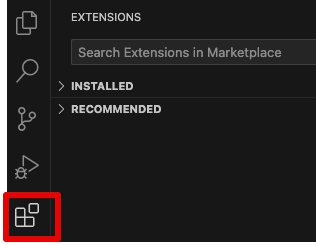
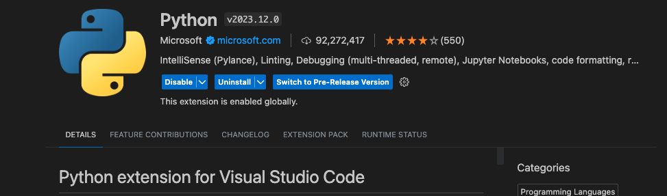
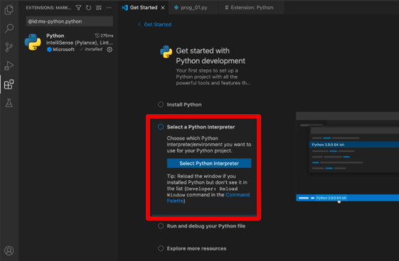
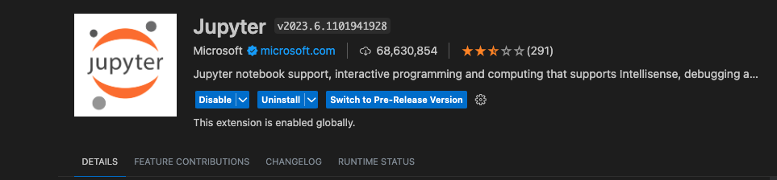

# Setting up Python and VS Code

- [Setting up Python and VS Code](#setting-up-python-and-vs-code)
  - [Overview](#overview)
  - [Python](#python)
    - [Installing Python](#installing-python)
      - [Windows](#windows)
      - [macOS](#macos)
  - [VS Code](#vs-code)
    - [Installing VS Code](#installing-vs-code)
    - [Installing VS Code Extensions](#installing-vs-code-extensions)
  - [Installing Python Packages](#installing-python-packages)
  - [Resources](#resources)


## Overview

In this tutorial, you will learn how to install Python, VS Code, VS Code Extensions and packages needed to be succesful in running the material for the Workshop.  

Note that VS Code is only one of many different Integrated Development Environments (IDE) and there are different ways to install Python.. This tutorial is meant to be as simple as possible and for a first time install. If you have already installed Python and have a preferred IDE, you can use your setup to run the material for the Workshop.

## Python

Python is a high-level, general-purpose programming language. Its design philosophy emphasizes code readability

### Installing Python

#### Windows

* Install Python from [python.org](https://www.python.org/downloads/). Use the Download Python button that appears first on the page to download the latest version. Download the installation file and follow the instructions.

#### macOS

* Install Python from [python.org](https://www.python.org/downloads/). Use the Download Python button that appears first on the page to download the latest version. Download the installation file and follow the instructions.
* Use `Terminal` to install **Xcode Command Line Tools**
  * Launch `Terminal` on your Mac using Spotlight search **(Cmd + Space)**
  * Type in the following command:
    * ```xcode-select --install```
  * You'll get a pop-up prompting you to install command line developer tools. Choose Install to continue.

## VS Code

Visual Studio Code (aka VS Code) is a general-purpose free code editor developed by Microsoft. It can be run locally on Windows, macOS, and Linux OSs or on a cloud environment. The main advantages of using VS Code as your IDE are:

* Multi-languages - VS Code supports out-of-the-box JavaScript, TypeScript, and Node.js, and has a variety of extensions that enable running other programming languages such as Python, R, etc.
* Extensions - VS Code has a large community support that builds and maintains a variety of extensions that extend the editor's capabilities and functionality. That includes extensions that support programming languages (such as Python, R, and Julia), plugs-in that enables connection with external applications (Git, Docker, Postgres, etc.), and other applications.

### Installing VS Code

Installing VScode is straightforward - go to the VScode website https://code.visualstudio.com/ and click on the Download button. Download the installation file and follow the instructions.

### Installing VS Code Extensions

To work with Python inside VS Code, you need to use Extensions, which include many useful features.

Here is how to install an extension on VS Code:

* Click the Extensions button on the left menu (marked with a red box on the screenshot below)
* Type the extension name on the search menu. Clicking on each extension will open a window with the extension details.
* Click the install button to install the extension




Install the following extensions:

**Python** - the main Python plug-in for VScode, enables to execute, debugging, code navigation, code formatting, etc. (more info available [here](https://marketplace.visualstudio.com/items?itemName=ms-python.python))

  

Once the extension is installed, you have to select a Python interpreter. -> Select the recommended Python interpreter on the list. -> If you have multiple Python versions installed on your computer, it's better to choose the latest version.

  

**Jupyter** - Jupyter notebook support, interactive programming and computing that supports Intellisense, debugging and more.



## Installing Python Packages

During the workshop we will use `jupyter notebooks` to run the interactive lectures and will use the `pandas` library. To install the packages do the following:

* Open VS Code
* Select Terminal -> New Terminal
* On the terminal type the following (this will install the packages):
  * `pip install --upgrade pip`
  * `pip install jupyterlab`
  * `pip install pandas`

## Resources

[Setting Up VSCode For Python: A Complete Guide](https://www.datacamp.com/tutorial/setting-up-vscode-python) 

[Getting Started with Python in VS Code](https://code.visualstudio.com/docs/python/python-tutorial) 
